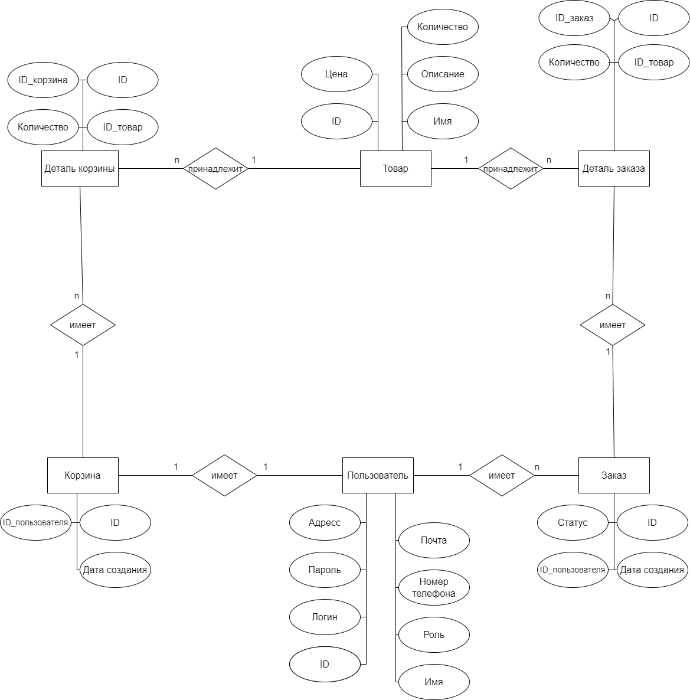
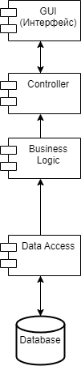
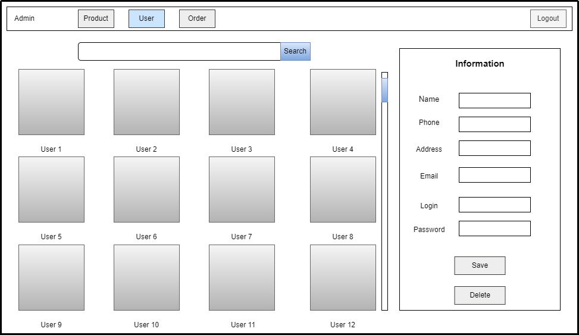
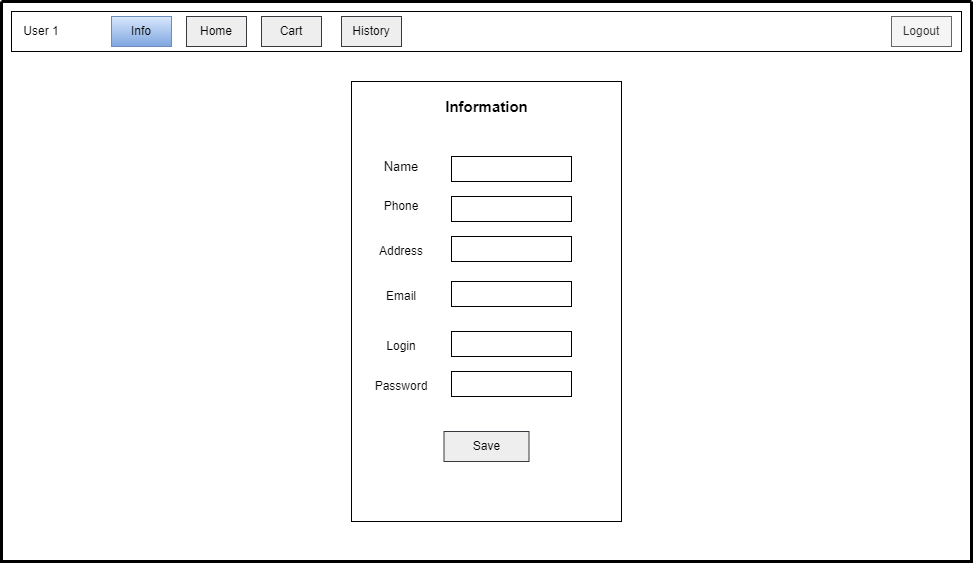
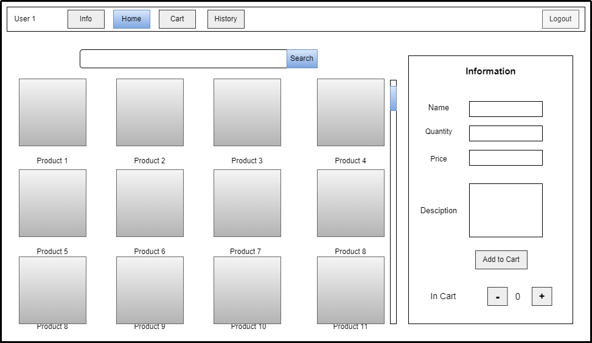
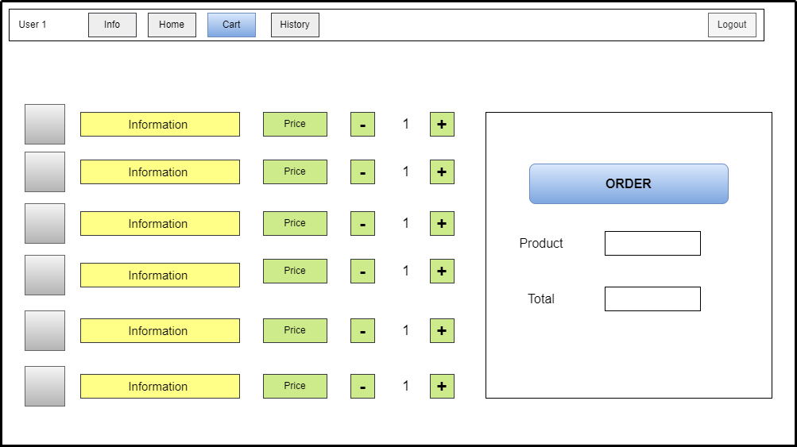

## 1. Цель работы
Целью данной работы является разработка Web-приложения компьютерного магазина

## 2. Функциональные требования
* Вход в систему / выход из системы
* Просмотреть список товаров, пользователей, заказов, деталей заказы
* Добавить / изменить / удалить товары
* Добавить / изменить / удалить заказы
* Добавить / изменить / удалить деталей заказы
* Добавить / изменить / удалить корзину

## 3. Use-Case  

## 4. BPMN диаграмма основных бизнес-процессов

## 5. Пользовательские сценарии  

`Клиент` имеет возможность посмотреть товары, заказать и измененить своих заказов, редактировать своих информации, выйти из системы.

`Адмитнистратор` имеет возможность добавить/изменить/удалить товары, пользователи, заказы, выйти из системы. 

`Гость` имеет возможность авторизовать.

## 6. ER 

## 7.  Диаграмма БД

## 8.  Компонетная диаграмма системы

## 9.  Экраны будущего web-приложения на уровне черновых эскизов

